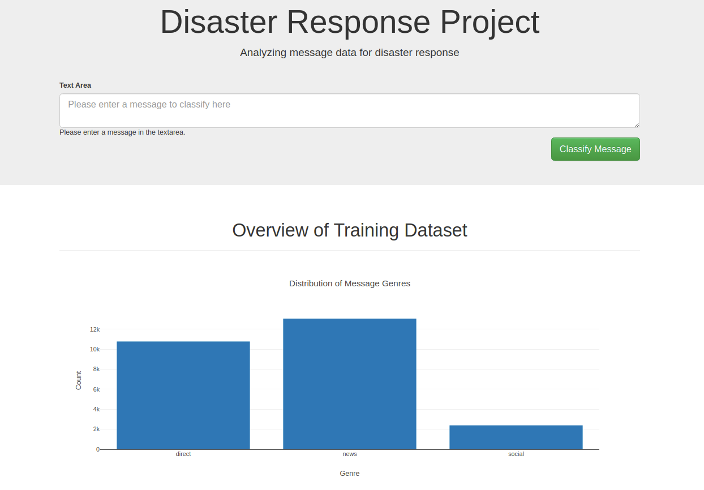
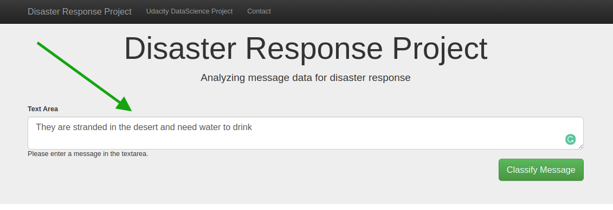
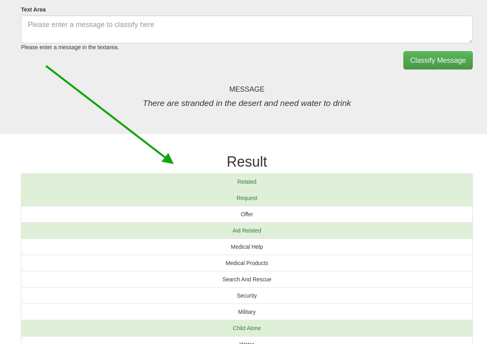
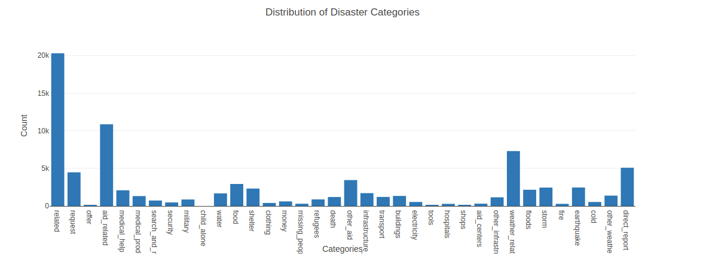

### Table of Contents

1. [Description](#Description)
2. [Project Motivation](#motivation)
2. [Installation](#installation)
3. [File Descriptions](#files)
4. [Results](#results)
5. [Licensing, Authors, and Acknowledgements](#licensing)

## Description <a name="installation"></a>

This project in Collaboration with Figure Eight is part of the fullfillment of the Udacity Data Science NanoDegree. The dataset here is provided by [Figure Eight](https://www.figure-eight.com/) and contains pre-labelled tweet and messages from real-life disaster events. 
This project is aim is to build a Natural Language Processing (NLP) model to categorize messages according to predefined Categories.

The Project is seperated into 3 main parts
 - ETL Pipeline for gathering the datasets and preparing them for the Maching learning Modeling step
 - ML Pipeline for building a NLP model and exporting saving into a database
 - Flask App for providing end user interactivity with the model and visualizations. 
 
 ---

    
## Dependencies <a name="Description"></a>
    - Python 3.x.x+
    - Machine Learning & ELT: Pandas, Numpy, Sciki-Learn
    - Natural Language Processes: nltk
    - Database: SQLalchemy (SQLite Database)
    - Model Persistence: Pickle
    - Web App and Data Visualization: Flask, Plotly
    
## Installation<a name="installation"></a>

    1. Clone the Repository 
    
        
    2. Run ETL Pipeline
    python data/process_data.py data/disaster_messages.csv data/disaster_categories.csv data/DisasteResponse.db
    
    3. Run ML Pipeline
    
    ```python
    
    python models/train_classifier.py data/DisasterResponse.db data/classifier.pkl
    
    ```
    
    4. Run Web App
     ```python
     
     cd app
     python run.py
     
     ```
     5. Access webapp on ```http://0.0.0.0:3001/``` on your browser


## File Descriptions <a name="files"></a>

There are 3 main parts

 - data folder: Data 
     - ETL Pipeline Preparation.ipynb: ETL pipeline notebook
     - process_data.py: Contain ETL pipeline python code for preparing data for ML pipeline
 - models folder : Contains machine learning files 
     - ML Pipeline Preparation.ipynb: ML pipeline notebook
     - train_classifier.py: Contain python code for running ML Pipelinne
  - app: Web App and Visualizations
      run.py: Main Falsk app
      template folder: contain templates files
 

## Results<a name="results"></a>

 1. A Model to run prediction on, after following installatin above the model is persisted to a pickle file in the data founder 'classifier.pkl'
 
 2. After the was ran an average **f1-score .94 was obtained, 94%**
 
 3. A web interface to test the model, inferfaces below 

 
 <center><h2><u>Fig1 - Home Screen</u></h2></center>

 


 <center><h2><u>Fig2 - Enter Question</u></h2></center>

 
  
---
 <center><h2><u>Fig3 - Predicted Results</u></h2></center>

 
 

  <center><h2><u>Fig4 - Distributed Categories</u></h2></center>

 

## Licensing, Authors, Acknowledgements<a name="licensing"></a>

Credits to [Figure Eight](https://www.figure-eight.com/)  for the data.  

### Author
[Fuh Austin](https://github.com/austin047/udacity-datascience-disaster-res-pipeline) 

# udacity-datascience-disaster-response-pipeline
